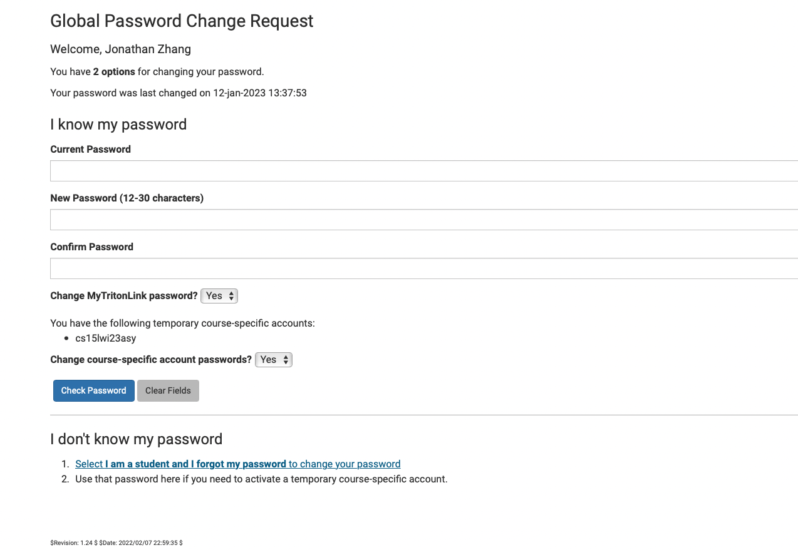
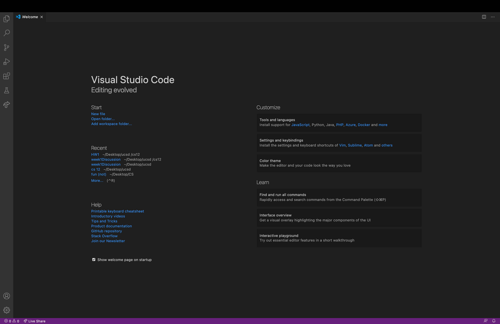
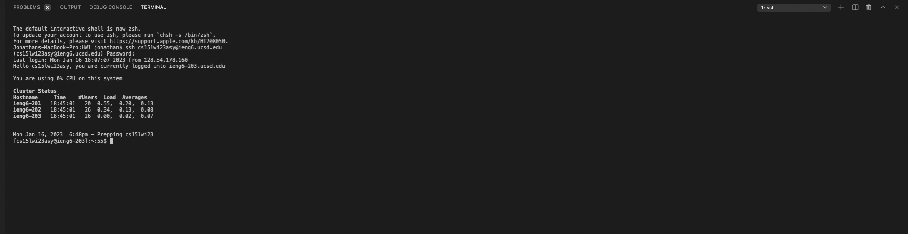
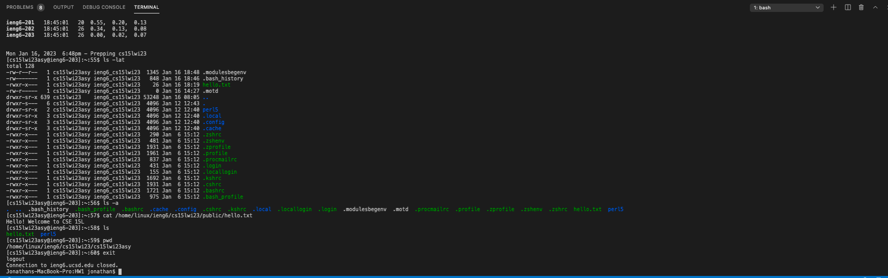

**CSE15L Account**\
-Visit https://sdacs.ucsd.edu/~icc/index.php to find your course-specifc account\
-Click on the “cs15lwi23asy” button (the last three characters may vary between people), click the change password button, and after filling out the “confirm password” field, press “enter” to reset your password

**VS Code**\
-Visit https://code.visualstudio.com/download to download the version of VS Code that you need\
-After installing it, open up VS Code

**Remotely Connecting**\
-In VS Code, open up a terminal and enter: ssh cs15lwi23zz@ieng6.ucsd.edu (the zz should be replaced with letters specific to your account)\
-If you connect to a server for the first time, you’ll receive a message saying the authenticity can’t be established. Type “yes” and press enter.\
-Finally, enter your password (you will not be able to see what you type so type carefully)

**Run Some Commands**\
-Try out some commands like cd (change directory), ls (list files and folders in path), pwd (print working directory), mkdir (make directory), cp (copy), and cat (print content)\
-To log out the server, use Ctrl-D or the command exit

