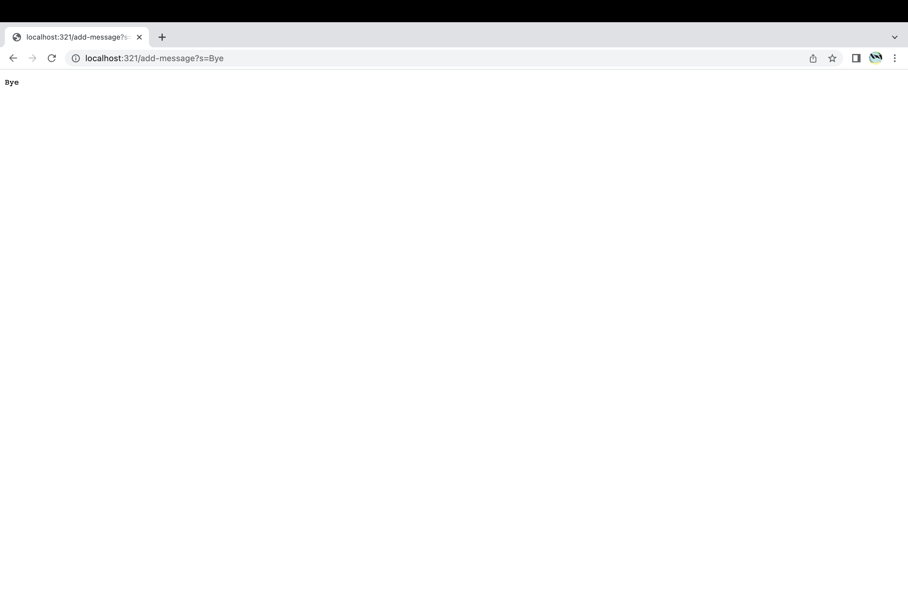
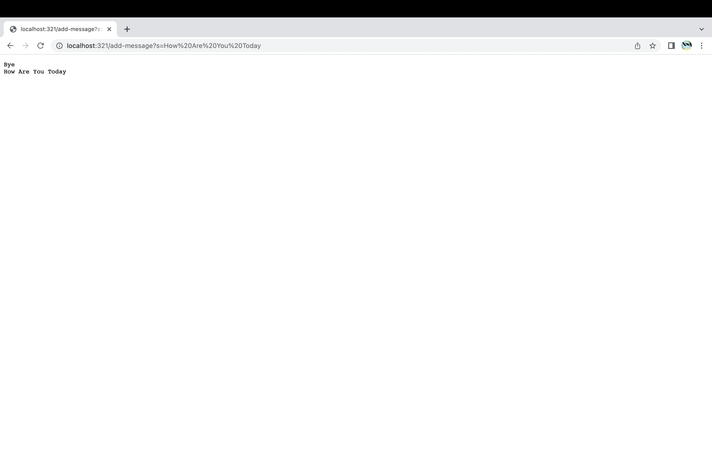
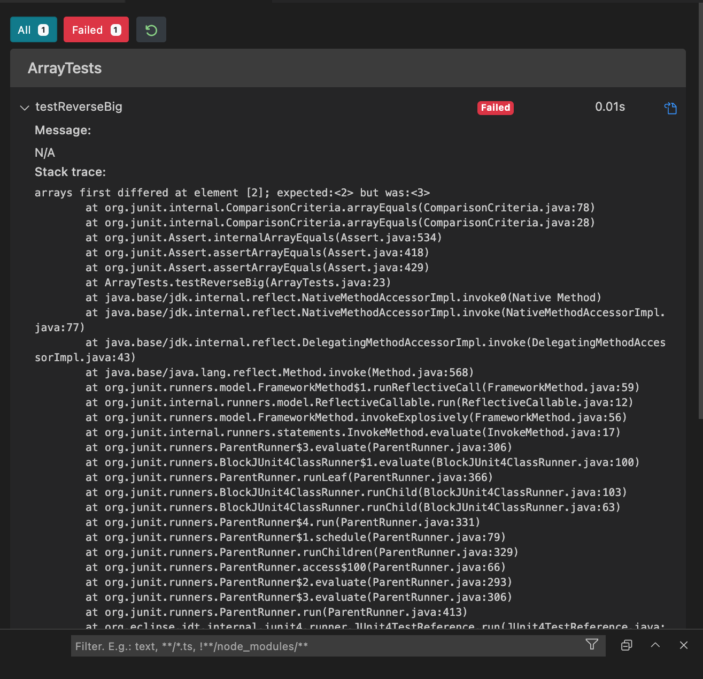
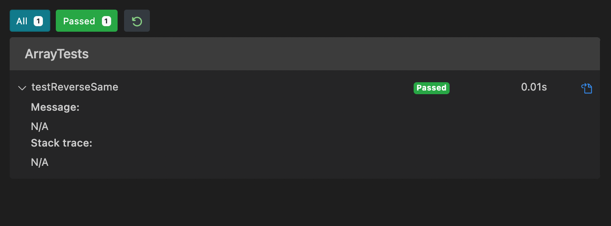

**Part 1**
```
import java.io.IOException;
import java.net.URI;

class Handler implements URLHandler {

    String x = "";

    public String handleRequest(URI url) {
        if (url.getPath().equals("/")) {
            return String.format(x);
        } else {
            System.out.println("Path: " + url.getPath());
            if (url.getPath().contains("/add-message")) {
                String[] parameters = url.getQuery().split("=");
                if (parameters[0].equals("s")) {
                    for (int ii = 1; ii < parameters.length; ii++) {
                        x += parameters[ii] + " ";
                    }
                    x += "\n";
                    return String.format(x);
                }
            }
        }
        return "404 Not Found!";
    }
}

class SearchEngine {
    public static void main(String[] args) throws IOException {
        if (args.length == 0) {
            System.out.println("Missing port number! Try any number between 1024 to 49151");
            return;
        }

        int port = Integer.parseInt(args[0]);

        Server.start(port, new Handler());
    }
}
```


-In both screeenshots, the methods handleRequest(), getPath(), contains(), equals(), split(), and getQuery() were called\
-In both screeenshots, the relevant argument for handleRequest() is `URI url` which is the url we enter. There are no relevant arguments for getPath (returns the path of the object) or getQuery (returns the query). The relevant argument for contains is `"/add-message"`, equals is `"/"`, and split is `"="`. The values include String x = `""` and parameters which is equal to `url.getQuery().split("=")`.\
-In pic 1, the query is equal to `s=Bye`, and my string x changes to `"Bye" + "\n"` which is what is displayed in the first pic.
-In pic 2, the query is equal to `s=How Are You Today`, and my string x is equal to `"Bye" + "\n" + "How Are You Today" + "\n` which is what is displayed in the second pic.

**Part 2**\
Failure-Inducing Input
```
@Test 
  public void testReverseBig() {
    int[] input = {1, 2, 3, 4};
    ArrayExamples.reverseInPlace(input);
    assertArrayEquals(new int[] {4, 3, 2, 1}, input);
  }
```
Non-Failure Input
``` 
@Test 
  public void testReverseSame() {
    int[] input = {1, 2, 2, 1};
    ArrayExamples.reverseInPlace(input);
    assertArrayEquals(new int[] {1, 2, 2, 1}, input);
  } 
```


Before
```
  static void reverseInPlace(int[] arr) {
    for(int i = 0; i < arr.length / 2; i += 1) {
      arr[i] = arr[arr.length - i - 1];
    }
  }
```
After
```
  static void reverseInPlace(int[] arr) {
    for(int i = 0; i < arr.length / 2; i += 1) {
      int x = arr[arr.length - i - 1];
      arr[arr.length - i - 1] = arr[i];
      arr[i] = x;
    }
  }
```
The initial code didn't work because it would replace the values in the first half of the array with the values from the second half of the array. For instance, the value at index 0 would be replaced by the value found in index x (size of the array - i - 1) which is in index in the second half of the array. The for loop would traverse through the entire first half of the array (as indicated by arr.length/2) and replace those values without replacing any values in the second half of the array, resulting in an incomplete reversal. In my fixed code, I made sure to replace values in both the first and second half of the array. For instance, I wanted to switch the values at index i and index x (size of the array - i - 1). I made sure to keep track of the value at index x while replacing index x's value with index i's value and then finally replacing index i's value with the value I had saved or the initial value at index x.
The initial code didn't work because it did not replace any of the values in the second half of the array. In my fixed code, as the for loop traverses the array, both halves of the array have their values replaced with the correct reverse values.\
**Part 3**\
In week 2, I learned about urls and more specifically, what the path and the query are and how to identify them in a url. In week 3, I learned about JUnit as a way to test my programs. Typically, I would have to handwrite my expected results and compare them to the programs which was bothersome at times. With JUnit, it makes the debugging process much more efficient and effective. 
