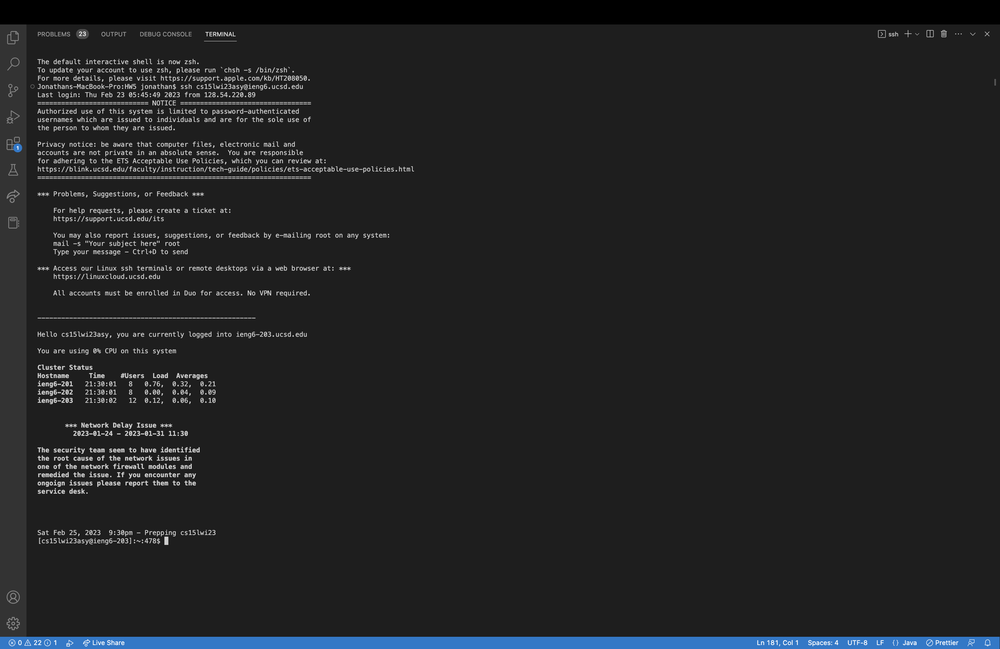
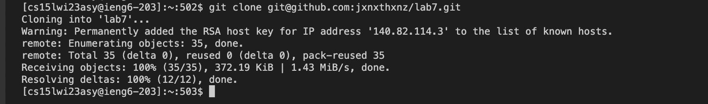
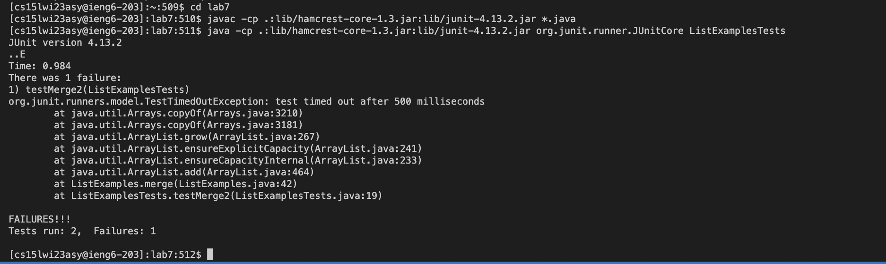
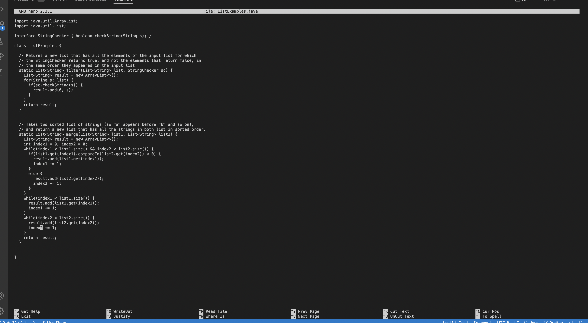
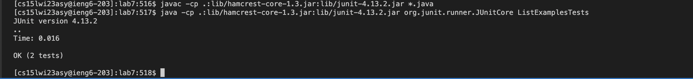
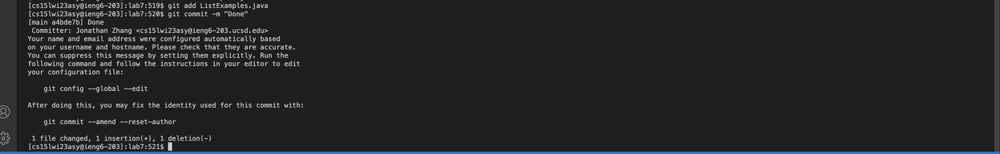

**Step 4**
```
ssh cs15lwi23asy@ieng6.ucsd.edu <enter>
```
I logged into my ieng6 account via ssh.


**Step 5**
```
git clone git@github.com:jxnxthxnz/lab7.git <enter>
```
I cloned a fork of the lab7 repository from my GitHub account via ssh.


**Step 6**
```
cd lab7 <enter>
javac -cp .:lib/hamcrest-core-1.3.jar:lib/junit-4.13.2.jar *.java <enter>
java -cp .:lib/hamcrest-core-1.3.jar:lib/junit-4.13.2.jar org.junit.runner.JUnitCore ListExamplesTests <enter>
```
I changed directory into lab7. I compiled all the files that ended with .java. I ran the ListExamplesTests file which contained the JUnit tests.


**Step 7**
```
nano ListExamples.java <enter>
<down> 42 times
<right> 12 times
<delete>
<2> <enter>
<ctrl-o> <enter>
<ctrl-x> <enter>
```
I used nano on the file I wanted to change, so I could edit it from my terminal. Move my cursor down and to the right. Change index1 to index2. Save my files via ^o and then exit out of nano with my last command.


**Step 8**
```
javac -cp .:lib/hamcrest-core-1.3.jar:lib/junit-4.13.2.jar *.java <enter>
java -cp .:lib/hamcrest-core-1.3.jar:lib/junit-4.13.2.jar org.junit.runner.JUnitCore ListExamplesTests <enter>
```
Recompile all the files ending in java. Run the tests file again, and it will say that all tests have passed.


**Step 9**
```
git add ListExamples.java
git commit -m "Done"
```
I committed and pushed the edited ListExamples file, and to confirm success, it prints out "Done."



